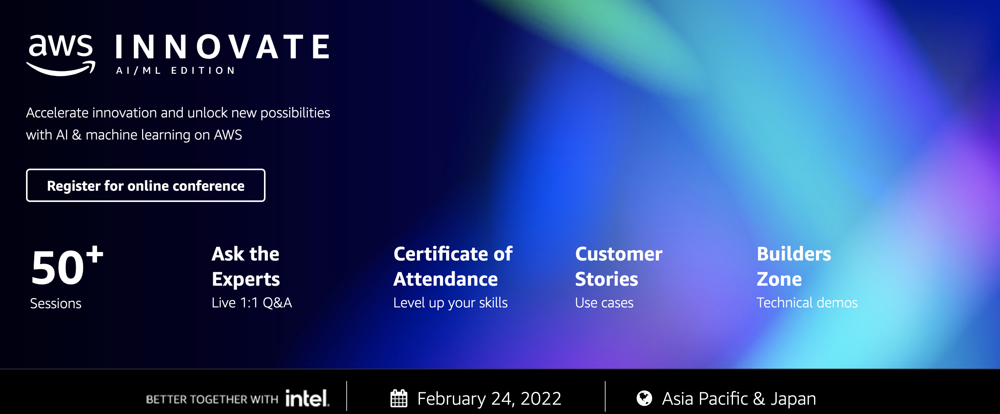

  

The following labs will give you hands-on experience with a number of the topics discussed during the AWS Innovate AI/ML Edition 2022.

ℹ️ **You will run these lab in your own AWS account. Please follow directions at the end of the labs to remove resources to minimize costs.**

These labs will remain available after AWS Innovate AI/ML Edition. **You can do them at any time**, even after AWS Innovate AI/ML Edition 2022.

## [Creating a multi-label classification model on SageMaker using BlazingText Algorithm](https://github.com/roshansthomas/sm-sentimentanalysis-bt)
The Amazon SageMaker BlazingText algorithm provides highly optimized implementations of the Word2vec and text classification algorithms. In this lab you will use the Amazon BlazingText algorithm with SageMaker to create a supervised multi-label text classification machine learning model.

Duration: Approximately 60 minutes

[View lab instructions](https://github.com/roshansthomas/sm-sentimentanalysis-bt)

## [Build, train, and debug machine learning models](https://github.com/roshansthomas/reinvent2019-aim362-sagemaker-debugger-model-monitor)

In this lab, we show the different aspects of the machine learning (ML) workflow for building, training, and deploying a model using all the capabilities of Amazon SageMaker. We also discuss how Amazon SageMaker removes the heavy lifting from each step of the ML workflow. Come learn how to build, train, debug, monitor, and deploy your ML models. 

Duration: Approximately 90 minutes

[View lab instructions](https://github.com/roshansthomas/reinvent2019-aim362-sagemaker-debugger-model-monitor)

## [Text Extraction and Analysis with Amazon Textract and Amazon Comprehend](https://github.com/roshansthomas/nlp-lab)
In this lab we will extract the features of a text document using Amazon Textract. Then use Amazon Comprehend to analyse the extracted features. We will learn how to connect aws services together using AWS Lambda.

Duration: Approximately 45 minutes

[View lab instructions](https://github.com/roshansthomas/nlp-lab)

## [Automating code  review with Amazon CodeGuru Reviewer](https://github.com/phonghuule/amazon-code-guru-sample)
This lab will  walk you through how to associate Amazon CodeGuru with your repo and automate  code review by using Amazon CodeGuru Reviewer

Duration: Approximately 45 minutes

[View lab instructions](https://github.com/phonghuule/amazon-code-guru-sample)

## [Detect Protective Equipment with Amazon Rekognition](https://github.com/phonghuule/amazon-rekognition-ppe)
Amazon Rekognition can detect Personal Protective Equipment (PPE) worn by persons in an image. You can use this information to improve workplace safety practices. In this lab, we are going to build a serverless web application to process frames from camera feeds for PPE detection.

Duration: Approximately 60 minutes

[View lab instructions](https://github.com/phonghuule/amazon-rekognition-ppe)

## [Deploy machine learning inference on AWS Lambda and Amazon EFS](https://github.com/aws-samples/ml-inference-using-aws-lambda-and-amazon-efs)
Learn how to deploy multiple machine learning models for inference on AWS Lambda and Amazon Elastic File Storage (Amazon EFS). In this repo, you will find all the codes needed to deploy your application for machine learning inference using AWS Lambda and Amazon EFS.

Duration: Approximately 60 minutes

[View lab instructions](https://github.com/aws-samples/ml-inference-using-aws-lambda-and-amazon-efs)

## [Amazon SageMaker components for Kubeflow pipelines](https://github.com/kubeflow/pipelines/tree/master/components/aws/sagemaker)
In this lab, learn how to install Kubeflow on Amazon EKS, run a single-node training, and inference using TensorFlow, train and deploy model locally and remotely using Kubeflow Fairing, setup Kubeflow pipeline, and review how to call AWS managed services such as Amazon SageMaker for training and inference.

Duration: Approximately 60 minutes

[View lab instructions](https://github.com/kubeflow/pipelines/tree/master/components/aws/sagemaker)

## [Operationalize a Machine Learning model with Amazon SageMaker Featurestore and Amazon SageMaker DataWrangler Using CDK](https://github.com/aws-samples/amazon-sagemaker-mlops-with-featurestore-and-datawrangler)
In this lab, we demonstrate how to build an end-to-end machine learning workflow including automated pipelines such as feature jobs and storing into SageMaker Feature Store, training and validating your models, deploying real-time endpoints, and batch inference to periodically store a large data set.

Duration: Approximately 60 minutes

[View lab instructions](https://github.com/phonghuule/amazon-rekognition-ppe)
